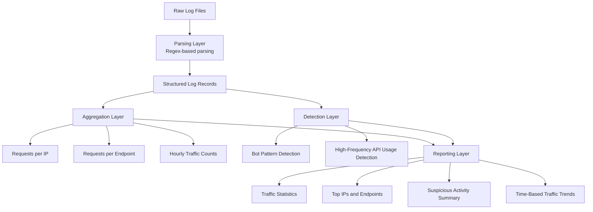

# LogInsight — Web Traffic Analysis Tool

[](https://github.com/finnxiii/loginsight)


LogInsight is a Python-based command-line tool for analysing web server logs to detect suspicious traffic patterns, monitor API usage, and identify traffic spikes.

Developed as part of the IEUK 2025 programme, the project demonstrates practical application of log parsing, data aggregation, and heuristic-based anomaly detection for real-world system monitoring.

<br>

> [!NOTE]
> This project emphasises simplicity and usability, providing a lightweight CLI interface that enables quick analysis of log data without requiring complex setup or infrastructure.

<br>

## Overview

LogInsight processes web server logs and extracts key metrics to help understand traffic behaviour:

- Total and API request volume  
- Per-IP and per-endpoint activity  
- Suspicious user agents (bots, crawlers, scripts)  
- Hourly traffic distribution  
- High-frequency or abnormal request patterns  

The tool is designed to work with structured logs and provide immediate, human-readable insights via the command line.

<br>

## System Architecture



**Flow Summary**
- Raw log entries are first parsed into structured records using regular expressions.
- The parsed data is then aggregated to extract request volumes by IP, endpoint, and time period.
- Heuristic detection rules are applied to identify suspicious behaviour, including bot-like user agents and unusual API request frequency.
- Finally, the tool generates concise reports highlighting traffic patterns, suspicious activity, and overall usage trends.

<br>

## Key Features

- Regex-based parsing of structured log data  
- Efficient aggregation using `Counter` and `defaultdict`  
- Heuristic detection of automated or suspicious traffic  
- Time-based analysis for identifying traffic spikes  
- Command-line interface for quick inspection  
- Docker support for reproducible execution  

<br>

## Tech Stack

### Software
- Python 3.8+  
- Standard libraries: `re`, `collections`, `datetime`  

### Infrastructure and Tools
- Docker (optional containerised execution)  
- Command-line interface  

<br>

## Design Considerations

- **Simplicity vs Flexibility:**  
  The tool prioritises a clear and lightweight implementation while supporting structured log formats.

- **Heuristic Detection:**  
  Bot detection is rule-based, trading completeness for interpretability and ease of extension.

- **Performance:**  
  Uses in-memory aggregation for fast analysis of moderate-sized log files.

Future improvement: Extend support for multiple log formats and enable streaming analysis for large-scale logs.

<br>

## Usage

Run the analyzer with a log file:

```bash
python analyze_logs.py sample-log.log
```

